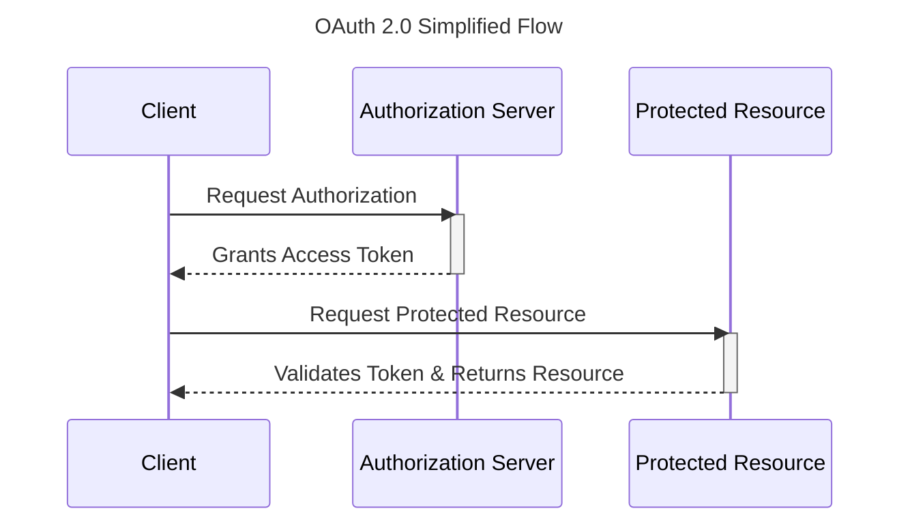

# Overview
This authorization server provides robust OAuth2 capabilities, supporting a variety of client applications. It enables secure access management, handling access token issuance, validation, and user authorization through OAuth2 flows. The server is designed to be easily integrable, providing the necessary endpoints and functionalities to support secure and scalable authorization.

# Usage
This repository provides a .NET implementation of the OAuth 2.0 protocol. To observe the full flow of OAuth 2.0 in action, you'll need to run three interconnected sample projects included in the solution:
* **`Shark.Sample.AuthorizationServer`**: This project acts as the **Authorization Server**. It's responsible for authenticating users, granting authorization, and issuing access tokens.
* **`Shark.Sample.Client`**: This project represents the **Client** application. It requests authorization from the user and uses the obtained access token to access protected resources.
* **`Shark.Sample.ProtectedResource`**: This project functions as the **Protected Resource**. It hosts the resources that the client wishes to access and validates access tokens presented by the client.
---
To run the sample and see the OAuth 2.0 flow:
1.  Ensure all three projects (`Shark.Sample.AuthorizationServer`, `Shark.Sample.Client`, and `Shark.Sample.ProtectedResource`) are built successfully within the solution.
2.  Run all three projects simultaneously. You can typically do this by setting multiple startup projects in Visual Studio or by running each project from its respective output directory.
3.  Follow the instructions provided within the `Shark.Sample.Client` application to initiate the OAuth 2.0 authorization process. This will guide you through the interactions with the Authorization Server and demonstrate how the client accesses the Protected Resource.

# Build Status
| Build server | Target |  Status |
|-|-|-|
| GitHub Actions | Build |  |
| GitHub Actions | Nuget |  |
| GitHub Actions | Nuget |  |

# Packages
| Package Source | Package Name | Status |
|-|-|-|
| NuGet | Shark.AuthorizationServer |  |
| NuGet | Shark.AuthorizationServer.Sdk |  |

# Specifications
- [The OAuth 2.0 Authorization Framework](https://datatracker.ietf.org/doc/html/rfc6749)
- [Proof Key for Code Exchange by OAuth Public Clients](https://datatracker.ietf.org/doc/html/rfc7636)
- [OAuth 2.0 Token Introspection](https://datatracker.ietf.org/doc/html/rfc7662)
- [OAuth 2.0 Token Revocation](https://datatracker.ietf.org/doc/html/rfc7009)
- [OAuth 2.0 Dynamic Client Registration Protocol](https://datatracker.ietf.org/doc/html/rfc7591)
- [OAuth 2.0 Dynamic Client Registration Management Protocol](https://datatracker.ietf.org/doc/html/rfc7592)
- [OAuth 2.0 Device Authorization Grant](https://datatracker.ietf.org/doc/html/rfc8628)
- [OpenID Connect Core 1.0 incorporating errata set 2](https://openid.net/specs/openid-connect-core-1_0.html)
